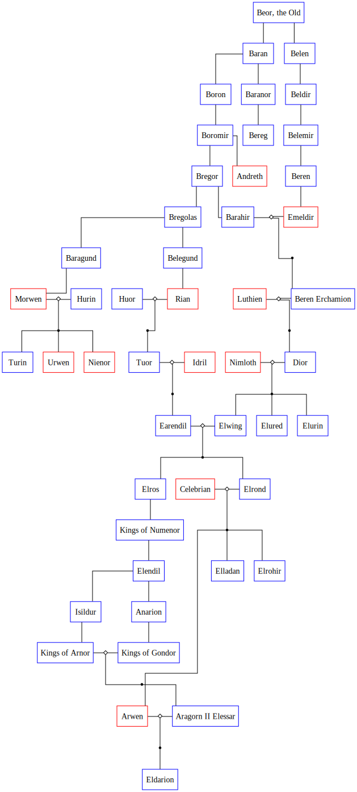
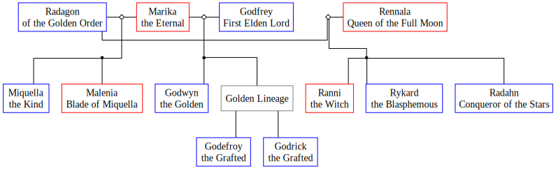

# pyFamilyTree
- Program for generating family trees based on individual character files.
- Currently algorithm loops through each character file and crawls up by 1 level to define parents.
- Support for crawl-down coming soon.

## Usage
1. Create a python venv, activate it, and download the requirements.
```bash
python -m venv venv
source venv/bin/activate
pip install -r requirements.txt
```
2. Change necessary parameters in `main.py`, then run `main.py`
```bash
python main.py
```
3. Once the `venv` is made, you may use `bash start.sh` instead.

### Input
- Folder of XML files containing full profiles of characters (see samples)

### Output
- Family tree as PDF or SVG
- PNG export may require install of `cairo`.

## Features
- Allow groups to be part of family tree (see examples)

## Examples
### House of Beor (The Lord of the Rings)


### Empyreans of the Lands Between (Elden Ring)



## TODO
- [ ] Refactor into package instead of everything in `main.py`
- [ ] Command line args
- Input formats:
    - [x] XML
    - [ ] JSON
    - [ ] TOML
    - [ ] JSON Canvas
- Output formats:
    - [ ] PDF
    - [ ] HTML
- [ ] Add port above each node for more nice drawing
- [ ] Support for images
- [ ] Support crawling down from ancestors
